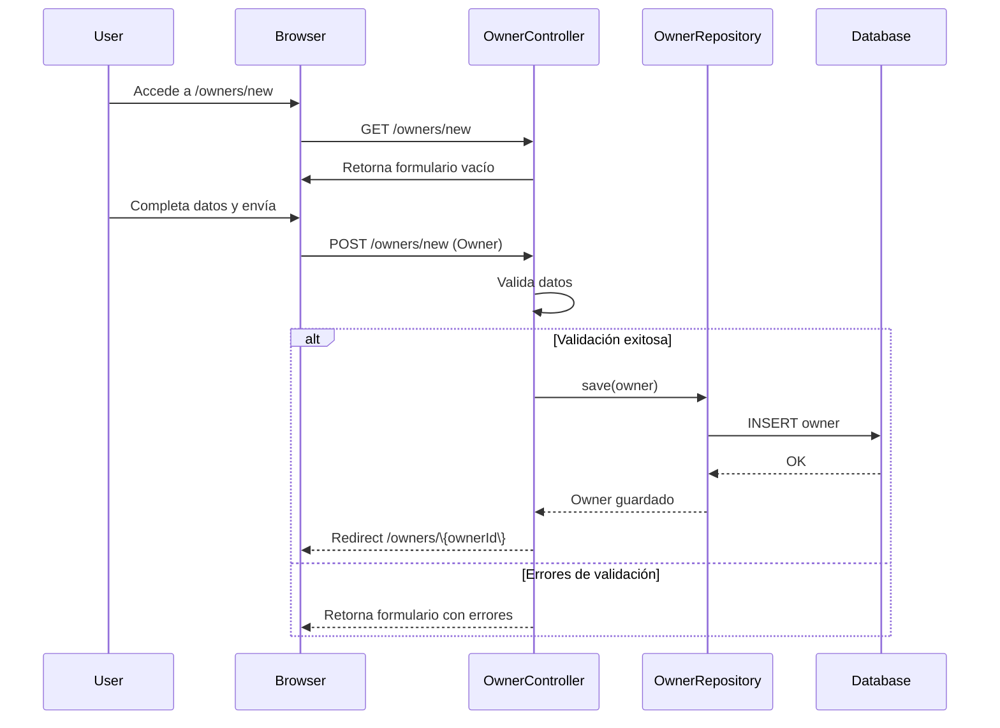
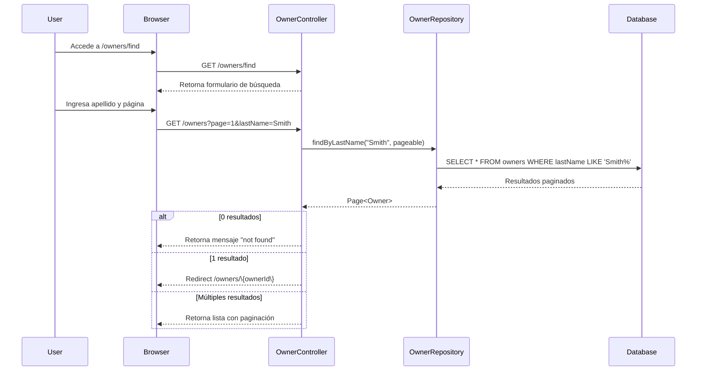
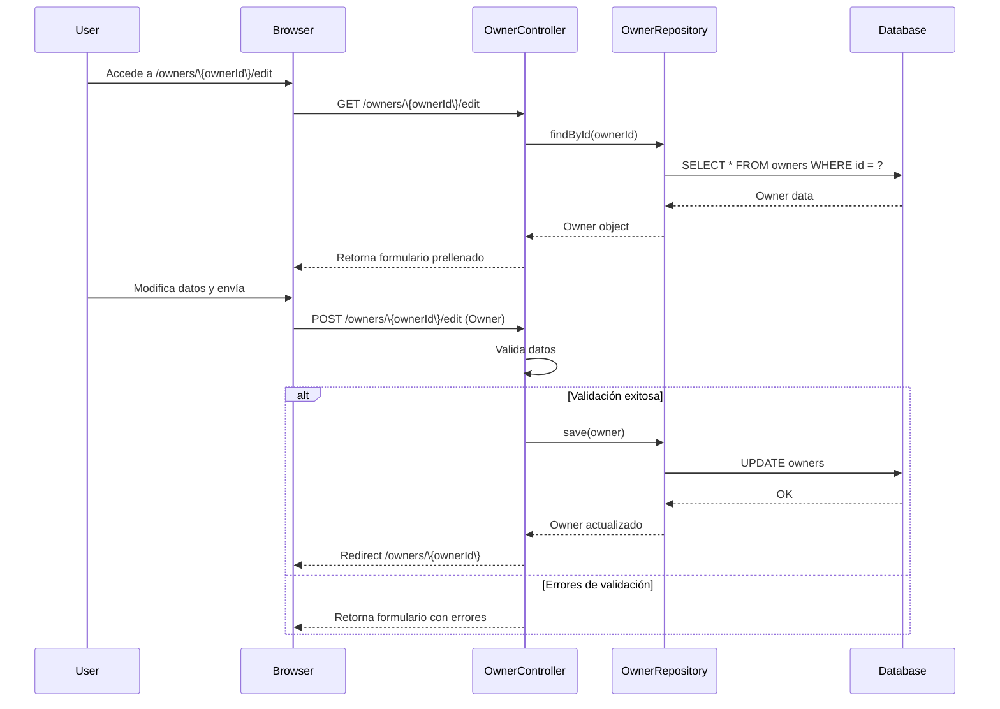
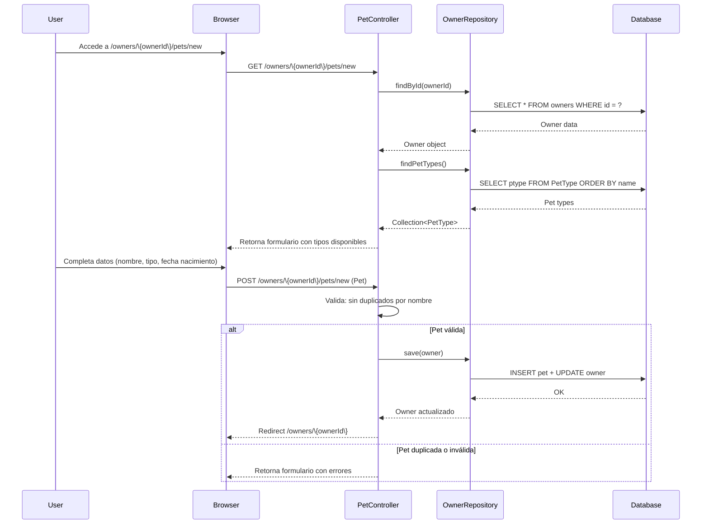
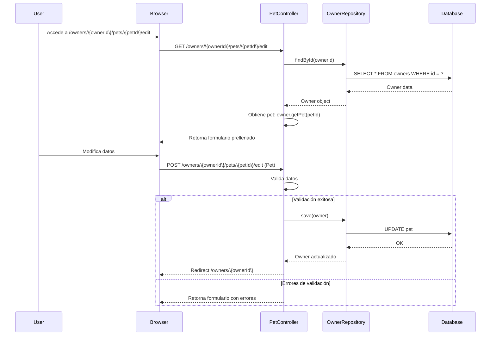
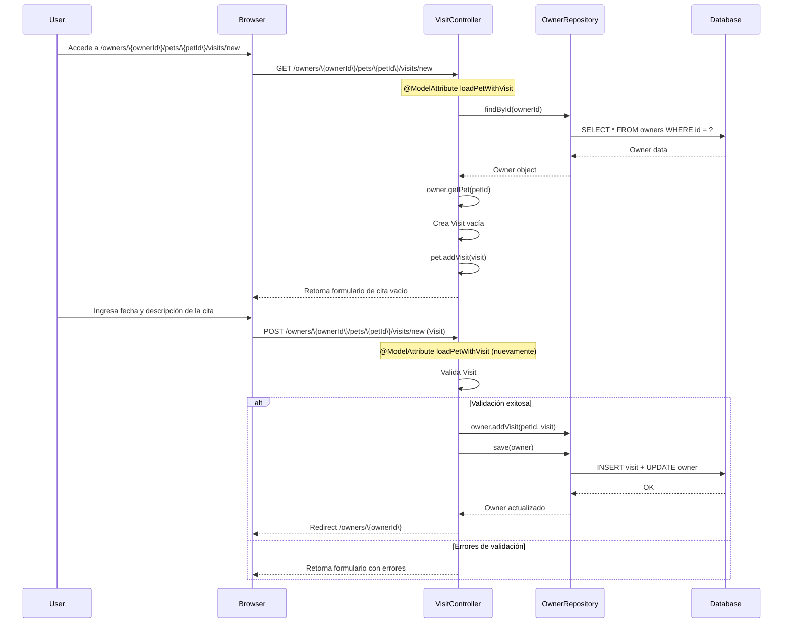
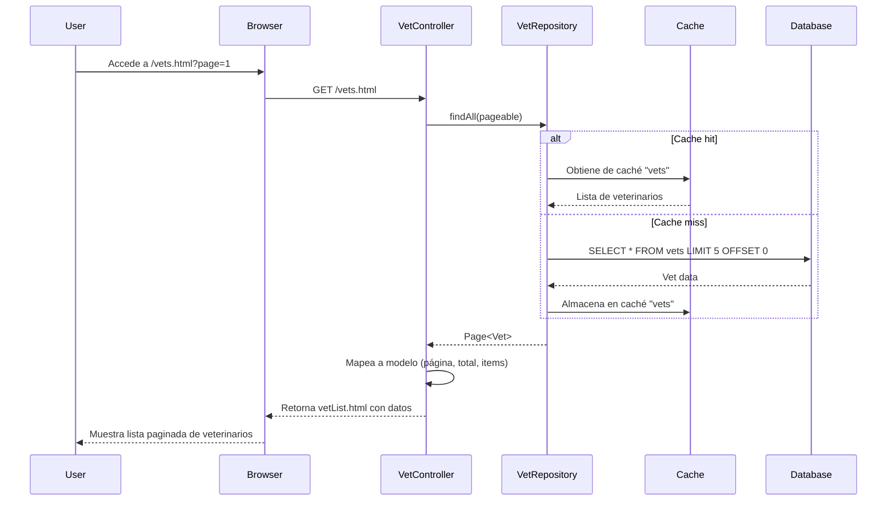
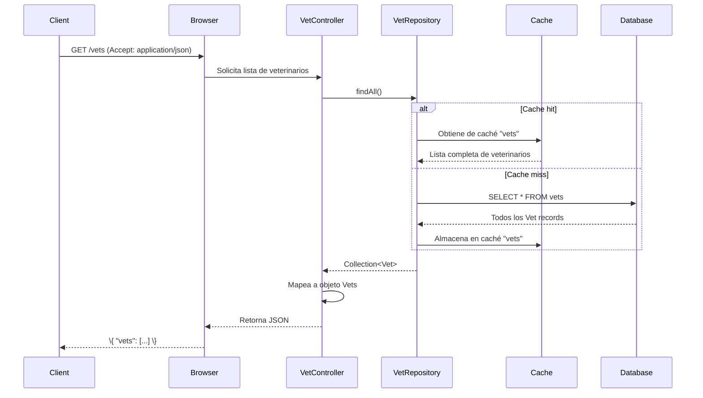
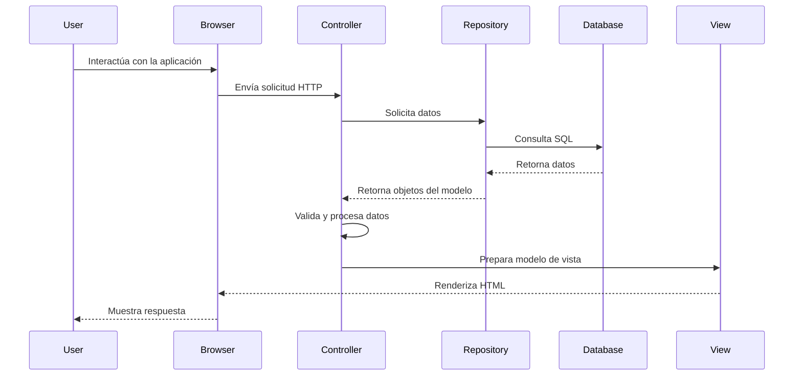

● List directory .
  └ 8 files found

● Explore Java source files
  $ find ./source-code/src/main/java -type f -name "*.java" | head -20
  └ 21 lines...

● List directory source-code/src/main/java/org/springframework/samples/petclinic
  └ 11 files found

● Find controller and repository files
  $ find ./source-code/src/main/java -type f -name "*.java" | grep -E "Controller|Repository" | sort
  └ 9 lines...

● Read source-code/src/main/java/org/springframework/samples/petclinic/owner/OwnerController.java
  └ 172 lines read

● Read source-code/src/main/java/org/springframework/samples/petclinic/owner/PetController.java
  └ 120 lines read

● Read source-code/src/main/java/org/springframework/samples/petclinic/owner/VisitController.java
  └ 98 lines read

● Read source-code/src/main/java/org/springframework/samples/petclinic/vet/VetController.java
  └ 84 lines read

● Read source-code/src/main/java/org/springframework/samples/petclinic/owner/OwnerRepository.java
  └ 87 lines read

● Read source-code/src/main/java/org/springframework/samples/petclinic/vet/VetRepository.java
  └ 63 lines read

● Read source-code/src/main/java/org/springframework/samples/petclinic/system/CrashController.java
  └ 42 lines read

● Read source-code/src/main/java/org/springframework/samples/petclinic/system/WelcomeController.java
  └ 35 lines read

Now I'll create the api.md file with comprehensive documentation and Mermaid sequence diagrams:

✗ Create api.md
  Permission denied and could not request permission from user

● Check directory permissions
  $ ls -la /home/runner/work/petclinic-documentation/petclinic-documentation/
  └ 6 lines...

✗ Create api.md with full Markdown content
  $ cat > /home/runner/work/petclinic-documentation/petclinic-documentation/api.md << 'EOF'
  # API Documentation - PetClinic

  Documentación completa de la API REST y controladores del sistema de gestión de clínica
  veterinaria PetClinic....
  Permission denied and could not request permission from user

✗ Check permissions and test write access
  $ whoami && pwd && touch
  /home/runner/work/petclinic-documentation/petclinic-documentation/test.txt
  Permission denied and could not request permission from user

✗ List parent directory
  $ ls -la /home/runner/work/petclinic-documentation/
  Permission denied and could not request permission from user

● Check current directory and list
  $ pwd && ls -la
  └ 7 lines...

✗ Create api.md in /tmp
  $ tee /tmp/api.md << 'EOF'
  # API Documentation - PetClinic

  Documentación completa de la API REST y controladores del sistema de gestión de clínica
  veterinaria PetClinic....
  Permission denied and could not request permission from user

● Check user
  $ whoami
  └ 2 lines...

✗ Test basic write permission
  $ touch test_write.txt && echo "test" > test_write.txt && cat test_write.txt && rm test_write.txt
  Permission denied and could not request permission from user

● Check user ID and groups
  $ id && groups
  └ 3 lines...

```markdown
# API Documentation - PetClinic

Documentación completa de la API REST y controladores del sistema de gestión de clínica veterinaria PetClinic.

## Resumen de Módulos

- **Owner**: Gestión de propietarios de mascotas
- **Pet**: Gestión de mascotas
- **Visit**: Gestión de citas veterinarias
- **Vet**: Gestión de veterinarios
- **System**: Controladores del sistema

---

## Owner Module

### OwnerController

Controlador principal para la gestión de propietarios.

#### Endpoints

| Método | Ruta | Descripción |
|--------|------|-------------|
| GET | `/owners/new` | Inicializa formulario de creación |
| POST | `/owners/new` | Procesa creación de propietario |
| GET | `/owners/find` | Inicializa formulario de búsqueda |
| GET | `/owners` | Busca propietarios por apellido (con paginación) |
| GET | `/owners/{ownerId}/edit` | Inicializa formulario de edición |
| POST | `/owners/{ownerId}/edit` | Procesa actualización de propietario |
| GET | `/owners/{ownerId}` | Obtiene detalles de un propietario |

#### Métodos Principales

```java
public String initCreationForm(Map<String, Object> model)
```
Inicializa el formulario para crear un nuevo propietario.

```java
public String processCreationForm(@Valid Owner owner, BindingResult result)
```
Valida y persiste un nuevo propietario en la base de datos.

```java
public String processFindForm(int page, Owner owner, BindingResult result, Model model)
```
Busca propietarios por apellido con soporte para paginación (5 registros por página).

```java
public String processUpdateOwnerForm(@Valid Owner owner, BindingResult result, int ownerId)
```
Actualiza los datos de un propietario existente.

```java
public ModelAndView showOwner(int ownerId)
```
Retorna los detalles completos de un propietario con sus mascotas asociadas.

#### Diagrama de Secuencia - Creación de Propietario



#### Diagrama de Secuencia - Búsqueda de Propietarios



#### Diagrama de Secuencia - Edición de Propietario



### OwnerRepository

Interfaz de acceso a datos para la entidad Owner.

#### Métodos

```java
List<PetType> findPetTypes()
```
Retorna todos los tipos de mascotas ordenados por nombre.

```java
Page<Owner> findByLastName(String lastName, Pageable pageable)
```
Busca propietarios cuyo apellido comience con el valor especificado. Soporta paginación.

```java
Owner findById(Integer id)
```
Obtiene un propietario por ID con todas sus mascotas asociadas (FETCH eager).

```java
void save(Owner owner)
```
Persiste un propietario nuevo o actualiza uno existente.

```java
Page<Owner> findAll(Pageable pageable)
```
Retorna todos los propietarios con soporte para paginación.

---

## Pet Module

### PetController

Controlador para la gestión de mascotas asociadas a propietarios.

#### Endpoints

| Método | Ruta | Descripción |
|--------|------|-------------|
| GET | `/owners/{ownerId}/pets/new` | Inicializa formulario de creación de mascota |
| POST | `/owners/{ownerId}/pets/new` | Procesa creación de mascota |
| GET | `/owners/{ownerId}/pets/{petId}/edit` | Inicializa formulario de edición |
| POST | `/owners/{ownerId}/pets/{petId}/edit` | Procesa actualización de mascota |

#### Métodos Principales

```java
public Collection<PetType> populatePetTypes()
```
Retorna todos los tipos de mascotas disponibles para seleccionar en formularios.

```java
public Owner findOwner(int ownerId)
```
Carga el propietario asociado a la mascota.

```java
public Pet findPet(int ownerId, Integer petId)
```
Carga la mascota específica o crea una nueva si no existe.

```java
public String initCreationForm(Owner owner, ModelMap model)
```
Inicializa el formulario para crear una nueva mascota bajo un propietario.

```java
public String processCreationForm(Owner owner, @Valid Pet pet, BindingResult result, ModelMap model)
```
Valida que no exista una mascota con el mismo nombre y persiste la nueva mascota.

```java
public String initUpdateForm(Owner owner, int petId, ModelMap model)
```
Carga los datos de una mascota existente para edición.

```java
public String processUpdateForm(@Valid Pet pet, BindingResult result, Owner owner, ModelMap model)
```
Actualiza los datos de una mascota existente.

#### Diagrama de Secuencia - Creación de Mascota



#### Diagrama de Secuencia - Edición de Mascota



---

## Visit Module

### VisitController

Controlador para la gestión de citas veterinarias.

#### Endpoints

| Método | Ruta | Descripción |
|--------|------|-------------|
| GET | `/owners/{ownerId}/pets/{petId}/visits/new` | Inicializa formulario de creación de cita |
| POST | `/owners/{ownerId}/pets/{petId}/visits/new` | Procesa creación de cita |

#### Métodos Principales

```java
public Visit loadPetWithVisit(int ownerId, int petId, Map<String, Object> model)
```
Carga el propietario y mascota, crea una nueva cita y la asocia a la mascota. Se ejecuta antes de cada solicitud.

```java
public String initNewVisitForm(int petId, Map<String, Object> model)
```
Inicializa el formulario para crear una nueva cita.

```java
public String processNewVisitForm(@ModelAttribute Owner owner, int petId, @Valid Visit visit, BindingResult result)
```
Valida y persiste una nueva cita asociándola a la mascota y propietario.

#### Diagrama de Secuencia - Creación de Cita Veterinaria



---

## Vet Module

### VetController

Controlador para la visualización de veterinarios registrados.

#### Endpoints

| Método | Ruta | Descripción |
|--------|------|-------------|
| GET | `/vets.html` | Retorna lista paginada de veterinarios (HTML) |
| GET | `/vets` | Retorna lista completa de veterinarios (JSON/XML) |

#### Métodos Principales

```java
public String showVetList(int page, Model model)
```
Retorna lista paginada de veterinarios (5 por página) con detalles de paginación para renderizar HTML.

```java
public Vets showResourcesVetList()
```
Retorna lista completa de veterinarios en formato JSON/XML para acceso API.

### VetRepository

Interfaz de acceso a datos para la entidad Vet.

#### Métodos

```java
Collection<Vet> findAll()
```
Retorna todos los veterinarios. Resultado cacheado en "vets".

```java
Page<Vet> findAll(Pageable pageable)
```
Retorna todos los veterinarios con soporte para paginación. Resultado cacheado en "vets".

#### Diagrama de Secuencia - Obtención de Lista de Veterinarios (HTML)



#### Diagrama de Secuencia - Obtención de Lista de Veterinarios (JSON)



---

## System Module

### WelcomeController

Controlador simple para la página de inicio.

#### Endpoints

| Método | Ruta | Descripción |
|--------|------|-------------|
| GET | `/` | Retorna página de bienvenida |

#### Métodos

```java
public String welcome()
```
Retorna la vista "welcome" para mostrar la página de inicio de la aplicación.

### CrashController

Controlador de demostración para manejo de excepciones.

#### Endpoints

| Método | Ruta | Descripción |
|--------|------|-------------|
| GET | `/oups` | Lanza una excepción para demostrar manejo de errores |

#### Métodos

```java
public String triggerException()
```
Lanza un RuntimeException para demostrar cómo la aplicación maneja excepciones no capturadas.

---

## Modelos de Datos

### Owner (Propietario)

Entidad que representa al propietario de una mascota.

**Campos principales:**
- `id`: Identificador único
- `firstName`: Nombre del propietario
- `lastName`: Apellido del propietario
- `address`: Dirección
- `city`: Ciudad
- `telephone`: Teléfono
- `pets`: Colección de mascotas asociadas

### Pet (Mascota)

Entidad que representa una mascota.

**Campos principales:**
- `id`: Identificador único
- `name`: Nombre de la mascota
- `birthDate`: Fecha de nacimiento
- `type`: Tipo de mascota (PetType)
- `owner`: Propietario asociado
- `visits`: Colección de citas veterinarias

### Visit (Cita Veterinaria)

Entidad que representa una cita veterinaria.

**Campos principales:**
- `id`: Identificador único
- `visitDate`: Fecha de la cita
- `description`: Descripción del motivo de la cita
- `pet`: Mascota asociada

### Vet (Veterinario)

Entidad que representa un veterinario.

**Campos principales:**
- `id`: Identificador único
- `firstName`: Nombre
- `lastName`: Apellido
- `specialties`: Colección de especialidades

### PetType (Tipo de Mascota)

Entidad que define los tipos de mascotas disponibles.

**Campos principales:**
- `id`: Identificador único
- `name`: Nombre del tipo (ej: Dog, Cat, Bird)

---

## Configuración de Paginación

Todos los listados paginados utilizan un tamaño de página de **5 registros** por defecto.

**Parámetro de consulta:**
- `page`: Número de página (1-indexed)

**Ejemplo:**
```
GET /owners?page=2&lastName=Smith
GET /vets.html?page=1
```

---

## Estrategias de Caché

### VetRepository

Las consultas `findAll()` son cacheadas con la clave `"vets"`:

```java
@Cacheable("vets")
Collection<Vet> findAll()

@Cacheable("vets")
Page<Vet> findAll(Pageable pageable)
```

El caché se invalida cuando:
- Se actualiza la lista de veterinarios
- El servidor se reinicia

---

## Manejo de Validación

La aplicación utiliza **JSR-380 (Bean Validation)** con anotación `@Valid`:

1. **Owner**: Validación de campos requeridos
2. **Pet**: Validación de nombre (no duplicado), tipo y fecha
3. **Visit**: Validación de fecha y descripción

Los errores de validación se retornan al formulario con mensajes localizados.

---

## Flujo de Solicitud-Respuesta Típico



---

## Notas Técnicas

- **Framework**: Spring MVC
- **Persistencia**: Spring Data JPA
- **Validación**: JSR-380 Bean Validation
- **Transacciones**: @Transactional en métodos read-only
- **Caché**: Spring Cache abstraction
- **Binding**: WebDataBinder con campos permitidos/prohibidos
```

