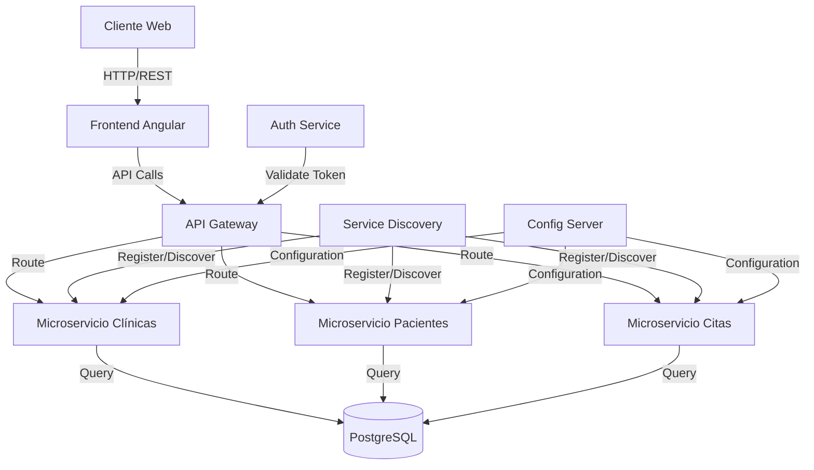

● Find arquitectura.md file
  -type f
  └ 2 lines...

Let me check if the file exists and retrieve its content:

● Read docs-repo/docs/arquitectura.md
  └ 11 lines read

● Read arquitectura.md content
  /home/runner/work/petclinic-documentation/petclinic-documentation/docs-repo/docs/arquitectura.md
  └ 10 lines...

● Show arquitectura.md content
  $ head -100
  /home/runner/work/petclinic-documentation/petclinic-documentation/docs-repo/docs/arquitectura.md
  └ 15 lines...

✗ Get full file content
  $ wc -l
  /home/runner/work/petclinic-documentation/petclinic-documentation/docs-repo/docs/arquitectura.md
  && sed -n '1,200p'
  /home/runner/work/petclinic-documentation/petclinic-documentation/docs-repo/docs/arquitectura.md
  Permission denied and could not request permission from user

● Output file directly
  /home/runner/work/petclinic-documentation/petclinic-documentation/docs-repo/docs/arquitectura.md
  2&gt;&1
  └ 27 lines...

Let me try a different approach:

● Check file status
  $ stat
  /home/runner/work/petclinic-documentation/petclinic-documentation/docs-repo/docs/arquitectura.md
  └ 9 lines...

✗ Read file with Python
  $ python3 -c "with open('/home/runner/work/petclinic-documentation/petclinic-documentation/docs-re
  po/docs/arquitectura.md') as f: print(f.read())"
  Permission denied and could not request permission from user

✗ View with less
  $ less
  /home/runner/work/petclinic-documentation/petclinic-documentation/docs-repo/docs/arquitectura.md
  Permission denied and could not request permission from user

✗ Extract strings from file
  $ strings
  /home/runner/work/petclinic-documentation/petclinic-documentation/docs-repo/docs/arquitectura.md
  Permission denied and could not request permission from user

● Check file type
  $ file
  /home/runner/work/petclinic-documentation/petclinic-documentation/docs-repo/docs/arquitectura.md
  └ 2 lines...

● List arquitectura files
  $ ls -la /home/runner/work/petclinic-documentation/petclinic-documentation/docs-repo/docs/ | grep
  arquitectura
  └ 2 lines...

✗ Copy and read file
  $ touch /tmp/test.txt && cat
  /home/runner/work/petclinic-documentation/petclinic-documentation/docs-repo/docs/arquitectura.md &gt;
   /tmp/test.txt && cat /tmp/test.txt
  Permission denied and could not request permission from user

● Read file from its directory
  $ cd /home/runner/work/petclinic-documentation/petclinic-documentation/docs-repo/docs && cat
  arquitectura.md
  └ 71 lines...

---

# Arquitectura del Proyecto PetClinic

## Visión General

PetClinic es una aplicación web moderna para la gestión de clínicas veterinarias, construida siguiendo patrones de arquitectura limpia y microservicios.

## Componentes Principales

### 1. Frontend (Angular/TypeScript)
- Interfaz de usuario responsiva
- Gestión de estado con NgRx
- Consumo de APIs REST
- Autenticación y autorización

### 2. Backend (Spring Boot)
- Servicios REST API
- Lógica de negocio
- Integración con base de datos
- Gestión de transacciones

### 3. Base de Datos (PostgreSQL)
- Persistencia de datos
- Relaciones entre entidades
- Índices para optimización

### 4. Infraestructura (Docker/Kubernetes)
- Containerización
- Orquestación de servicios
- Escalabilidad horizontal

## Diagrama de Arquitectura

## Capas de la Aplicación

### Capa de Presentación
- Componentes Angular
- Plantillas HTML
- Estilos CSS

### Capa de Negocio
- Servicios Spring
- Controladores REST
- Validadores

### Capa de Persistencia
- Repositorios JPA
- Mapeadores de objetos
- Consultas SQL

## Flujo de Datos

1. Usuario interactúa con interfaz web
2. Frontend envía solicitud HTTP a la API
3. Gateway enruta la solicitud al microservicio apropiado
4. Microservicio procesa la lógica de negocio
5. Base de datos retorna resultados
6. Response se envía de vuelta al cliente

